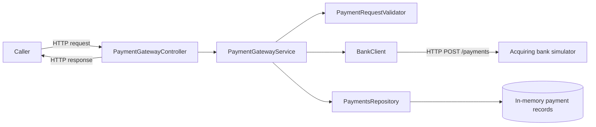
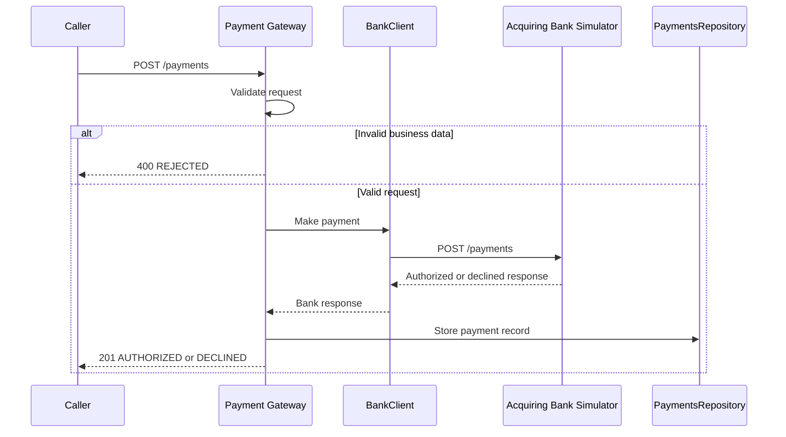

# Payment Gateway Challenge

A Java 17 and Spring Boot payment gateway that validates payment requests, submits valid requests to an acquiring-bank simulator, and stores completed payment records in memory.

## Overview

The gateway exposes a small HTTP API for creating and retrieving payments. It validates data before making an external call, translates bank outcomes into gateway payment statuses, and returns only the last four card digits. It also provides structured logs, request correlation, health checks, and metrics.

## Requirements

- JDK 17
- Docker and Docker Compose

## Run Locally

Build and start the gateway and acquiring-bank simulator:

```bash
docker compose up -d
```

To rebuild the gateway image after code changes:

```bash
docker compose up --build -d
```

The containerized gateway runs on `http://localhost:8090`. Interactive API documentation is available at [Swagger UI](http://localhost:8091/swagger-ui/index.html). Use `docker compose logs -f gateway` to view application logs and `docker compose down` to stop the stack.


To run the gateway directly instead of in Docker, first start only the bank simulator with `docker compose up -d bank_simulator`, then run:

```bash
./gradlew bootRun
```

Run all automated tests:

```bash
./gradlew test
```

## Dependencies

| Dependency | Purpose |
| --- | --- |
| Spring Boot Web | REST API, embedded Tomcat, and HTTP client support |
| Spring Boot Actuator | Health and metrics endpoints |
| Micrometer Prometheus Registry | Prometheus-format metrics export |
| Logstash Logback Encoder | Structured JSON console logs |
| Springdoc OpenAPI | Swagger UI and OpenAPI documentation |
| Spring Boot Test | JUnit 5, Mockito, MockMvc, and Spring test support |

## Architecture



### Application Structure

| Layer | Responsibility |
| --- | --- |
| `controller` | Maps HTTP requests and responses to application operations. |
| `service` | Coordinates validation, bank authorization, response mapping, logging, and metrics. |
| `repository` | Stores and retrieves payment records. The current implementation is in memory. |
| `model` | Defines request, response, bank-contract, and error data transfer objects. |
| `configuration` | Configures `RestTemplate` timeouts and request correlation. |
| `exception` | Translates domain and dependency exceptions into consistent HTTP errors. |

### Design Patterns

| Pattern | Implementation |
| --- | --- |
| Layered architecture | Controller, service, repository, and model packages separate concerns. |
| Service layer | `PaymentGatewayService` owns the payment-processing use case. |
| Repository | `PaymentRepositoryInt` abstracts payment persistence from the service. |
| Gateway/adapter | `BankPaymentGatewayInt` abstracts the acquiring-bank integration; `BankClient` implements it using HTTP. |
| Dependency injection | Spring injects collaborators through constructors. |
| Exception translation | Bank/client failures are converted to `BankCommunicationException` and then mapped to gateway HTTP responses. |
| DTO | Request and response models define the gateway and bank data contracts. |

## Payment Flow



Malformed JSON is rejected before the controller processes the request and returns `400 Bad Request`. A bank communication failure returns a gateway error and is not persisted.

## Bank Simulator Contract

The gateway depends on the simulator defined in [imposters/bank_simulator.ejs](imposters/bank_simulator.ejs). This is an integration contract, not the public API surface, but it is important to understand the gateway behaviour.

| Simulator condition | HTTP response | Gateway interpretation |
| --- | --- | --- |
| Required fields missing | `400 Bad Request` | `500 Internal Server Error` at the gateway layer because it indicates an upstream contract/integration problem. |
| Card number ends with odd digit (`1,3,5,7,9`) | `200 OK` with `authorized: true` | Gateway maps to `AUTHORIZED`. |
| Card number ends with even digit (`2,4,6,8`) | `200 OK` with `authorized: false` | Gateway maps to `DECLINED`. |
| Card number ends with zero (`0`) | `503 Service Unavailable` | Gateway maps this dependency failure to `503 Service Unavailable` for the caller. |

This contract explains why the gateway does not treat every bank failure as a malformed-request issue and why a bank response can legitimately produce a `DECLINED` outcome rather than an HTTP error.

## API

The application exposes versioned public endpoints under `/api/v1`.

| Method | Path | Description |
| --- | --- | --- |
| `POST` | `/api/v1/payments` | Validates and processes a payment request. Returns `201 Created` for authorized/declined outcomes or `400 Bad Request` for rejected validation. |
| `GET` | `/api/v1/payment/{id}` | Returns an existing payment by gateway UUID. Returns `200 OK` when the record exists. |

Full endpoint schemas and interactive requests are available at [Swagger UI](http://localhost:8091/swagger-ui/index.html).

### Create a Payment

`POST /api/v1/payments`

Every response includes an `X-Correlation-ID` header. A caller can provide this header; otherwise the gateway generates a UUID.

#### Request Fields

| JSON field | Java type | Required | Rules | Example |
| --- | --- | --- | --- | --- |
| `card_number` | `String` | Yes | 14-19 numeric digits | `4111111111111111` |
| `expiry_month` | `int` | Yes | Integer from 1 to 12 | `12` |
| `expiry_year` | `int` | Yes | Must form a month later than the current month | `2027` |
| `currency` | `String` | Yes | `USD`, `GBP`, or `EUR` | `GBP` |
| `amount` | `int` | Yes | Greater than zero; minor currency units | `100` |
| `cvv` | `String` | Yes | 3 or 4 numeric digits | `123` |

```json
{
  "card_number": "4111111111111111",
  "expiry_month": 12,
  "expiry_year": 2027,
  "currency": "GBP",
  "amount": 100,
  "cvv": "123"
}
```

#### Successful Response

`201 Created`

| JSON field | Java type | Description |
| --- | --- | --- |
| `id` | `UUID` | Gateway-generated identifier for retrieving the payment. |
| `status` | `String` | `Authorized`, `Declined`, or `Rejected`. |
| `cardNumberLastFour` | `String` | Last four digits only. Omitted when unavailable. |
| `expiryMonth` | `int` | Submitted expiry month. |
| `expiryYear` | `int` | Submitted expiry year. |
| `currency` | `String` | Submitted currency. |
| `amount` | `int` | Submitted amount in minor units. |

```json
{
  "id": "b30f8b27-6bf5-4e4a-bf6b-e69ac0b46a22",
  "status": "Authorized",
  "cardNumberLastFour": "1111",
  "expiryMonth": 12,
  "expiryYear": 2027,
  "currency": "GBP",
  "amount": 100
}
```

### Retrieve a Payment

`GET /api/v1/payment/{id}`

Returns `200 OK` and the same payment-response shape when the UUID exists.

## Errors

Error responses use this shape:

```json
{
  "message": "..."
}
```

| HTTP status | Condition | Response message | Caller action |
| --- | --- | --- | --- |
| `400 Bad Request` | Malformed JSON, wrong JSON field type, or failed business validation. | `Malformed payment request` or a `Rejected` payment response. | Correct the JSON shape or payment data, then retry. |
| `404 Not Found` | No payment exists for the requested ID. | `Page not found` | Confirm the payment UUID. Do not retry unchanged. |
| `500 Internal Server Error` | The bank returned a `4xx` response or returned a malformed response, indicating an integration-contract fault. | `Unable to process payment with the acquiring bank` | Do not repeatedly retry. Investigate the request/bank contract with the correlation ID. |
| `500 Internal Server Error` | Unexpected gateway error. | `Unable to process payment` | Capture the correlation ID and investigate logs. |
| `503 Service Unavailable` | Bank `5xx` response, timeout, or connection failure. | `Unable to process payment with the acquiring bank` | Retry later using normal backoff. |

Business-validation failures return `400 Bad Request` with `status: "Rejected"` and do not contact the bank. Malformed JSON also returns `400`, but uses the `ErrorResponse` shape.

## Configuration

| Property | Default/local value | Purpose |
| --- | --- | --- |
| `server.port` | `8090` | Gateway HTTP port. |
| `bank.url` | `http://localhost:8080` | Acquiring-bank simulator base URL. |
| `bank.connect-timeout` | `10s` | Maximum time to establish a bank connection. |
| `bank.read-timeout` | `10s` | Maximum time waiting for a bank response. |
| `management.endpoints.web.exposure.include` | `health,metrics,prometheus` | Exposes the operational endpoints. |

Operational endpoints:

| Endpoint | Purpose |
| --- | --- |
| `GET /actuator/health` | Application liveness/health status. |
| `GET /actuator/metrics` | Available Micrometer metric names. |
| `GET /actuator/metrics/{metricName}` | Details for a metric, including tags and measurements. |
| `GET /actuator/prometheus` | Prometheus scrape output. |

## Logging and Metrics

### Request Correlation and Logs

`docker compose logs gateway | grep [X-Correlation-ID]`

`CorrelationIdFilter` assigns an `X-Correlation-ID` to every incoming request. It uses a caller-provided safe value when supplied or generates a UUID otherwise. The ID is returned in the response header and added to the logging MDC for the request lifetime.

Logs are JSON records with a UTC timestamp, level, logger, thread, message, MDC fields, and stack trace when an unexpected error is logged. Payment card numbers and CVVs are never logged; only the last four card digits may be recorded.

To view detailed validation failures for rejected payments:

```bash
docker compose logs gateway | grep -i "payment_validation_errors"
```


#### Payment Event Examples

```json
{"@timestamp":"2026-09-14T10:15:31.820Z","level":"INFO","message":"event=payment_received amount=100 currency=GBP card_last_four=1111","correlationId":"checkout-request-123"}
{"@timestamp":"2026-09-14T10:15:31.862Z","level":"INFO","message":"event=bank_authorization_completed result=authorized duration_ms=42","correlationId":"checkout-request-123"}
{"@timestamp":"2026-09-14T10:15:31.866Z","level":"INFO","message":"event=payment_processed payment_id=b30f8b27-6bf5-4e4a-bf6b-e69ac0b46a22 status=AUTHORIZED duration_ms=46","correlationId":"checkout-request-123"}
{"@timestamp":"2026-09-14T10:17:04.252Z","level":"ERROR","message":"event=bank_authorization_failed failure_type=bank_unavailable upstream_status=503 duration_ms=10001","correlationId":"checkout-request-456"}
{"@timestamp":"2026-09-14T10:17:04.253Z","level":"ERROR","message":"event=payment_processing_failed failure_type=bank_error duration_ms=10002","correlationId":"checkout-request-456"}
```

### Metrics

`http://localhost:8090/actuator/metrics`

| Metric | Type | Tags | Meaning |
| --- | --- | --- | --- |
| `payments.processed` | Counter | `outcome` | Number of authorized, declined, and rejected payments. |
| `payments.processing.duration` | Timer | `outcome` | End-to-end payment-processing duration. |
| `payments.processing.failures` | Counter | `failure_type` | Payment processing failures. |
| `payments.retrieved` | Counter | `result` | Payment lookup results: `found` or `not_found`. |
| `bank.authorization.requests` | Counter | `outcome` | Successful bank authorizations and declines. |
| `bank.authorization.failures` | Counter | `failure_type` | Bank response and availability failures. |
| `bank.authorization.duration` | Timer | `outcome` | Bank-call duration. |

Example Prometheus output after an authorized payment:

```text
payments_processed_total{outcome="authorized"} 1.0
bank_authorization_requests_total{outcome="authorized"} 1.0
```

Metrics intentionally exclude payment IDs, correlation IDs, card data, and amounts from tags to avoid sensitive data exposure and high-cardinality time series.

## Testing

| Test class | Layer | Coverage |
| --- | --- | --- |
| `PaymentGatewayControllerTest` | Controller/integration | HTTP status and bodies, error mapping, correlation headers, health endpoint, and metrics endpoint. |
| `PaymentGatewayServiceTest` | Service | Validation short-circuiting, authorization/decline mapping, persistence, and propagated bank failures. |
| `BankClientTest` | Bank adapter | Bank payload mapping, valid/malformed response handling, bank `400`/`503`, and transport errors. |
| `PaymentRequestValidatorTest` | Validation | Card, expiry, currency, amount, CVV, missing-value, and null-request rules. |
| `PaymentsRepositoryTest` | Repository | Store/retrieve, unknown IDs, and existing-ID replacement behavior. |
| `CommonExceptionHandlerTest` | Exception handling | `404`, bank `4xx`/`5xx`, and unexpected-error HTTP mappings. |

The automated test suite is isolated from the live bank simulator. The simulator can be run locally with Docker for manual end-to-end verification.

## Design Decisions and Assumptions

- Malformed HTTP payloads are client-side input errors and return `400 Bad Request`.
- Business validation runs before the bank call; failed semantic validation produces `REJECTED` and is not persisted or sent to the bank.
- The bank simulator defines authorization semantics. Bank `4xx` responses are integration-contract faults (`500`); bank `5xx` responses and transport failures are temporary dependency failures (`503`).
- Supported currencies are limited to `USD`, `GBP`, and `EUR`.
- Only the last four card digits are stored and returned. The in-memory repository is appropriate for the challenge but not durable across restarts.